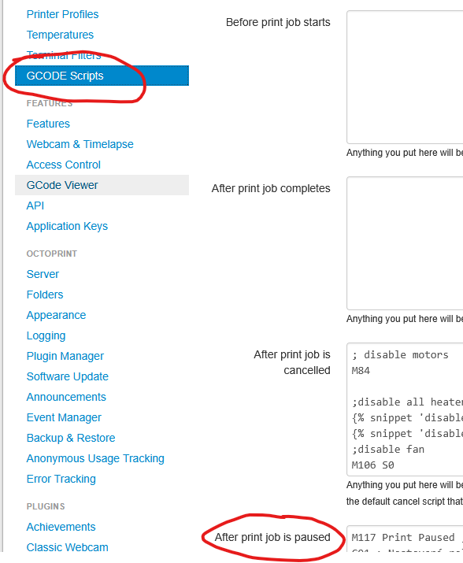

# 3D Printing with Creality S1 Pro

This README provides essential tips for using the Creality S1 Pro 3D printer, including guidance for integrating OctoPrint and specific G-code commands for pausing and resuming print jobs. Additionally, it explains the use of the M83 command, which is crucial for relative extruder movement on Creality printers.
OctoPrint Integration

When using OctoPrint to manage your Creality S1 Pro, you may need to include specific G-code commands to handle scenarios like pausing and resuming print jobs. Below are examples of G-code sequences tailored for this printer.



## G-code for Pausing a Print Job

Use the following commands when a print job is paused:

```
M117 Print Paused ; Display message on the printer screen
G91 ; Set relative positioning
G1 Z15 ; Raise the nozzle 15 mm away from the print
G90 ; Set absolute positioning
M104 S0 ; Turn off the nozzle heater
```

## G-code for Resuming a Print Job

Use these commands before resuming a paused print job:

```
M117 Print Resumed ; Display message on the printer screen
M190 S60         ; Wait until the bed reaches 60°C
M109 S200        ; Wait until the nozzle reaches 200°C
G91 ; Set relative positioning
G1 Z-15 ; Lower the nozzle back to its original position
G90 ; Set absolute positioning
M83 ; Set extruder to relative mode
```
   
Why is M83 Important?

The M83 command sets the extruder to relative mode, meaning extrusion distances are calculated relative to its current position. This is particularly useful when resuming prints because it ensures smooth extrusion without over- or under-extruding material. Without this command, your printer might attempt absolute extrusion (default behavior), leading to errors in material deposition.

**This is neccesary for Creality printer**