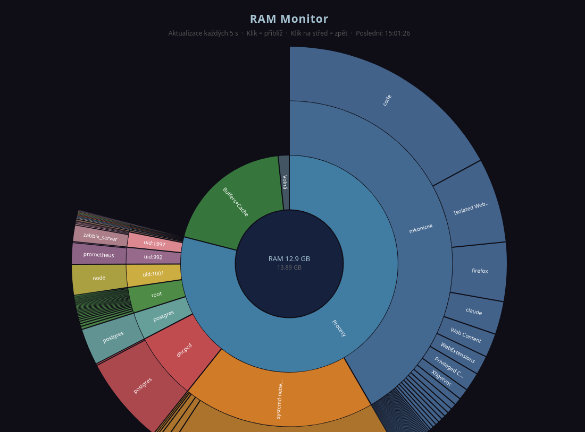

# RAM Monitor — Zoomable Sunburst Dashboard

An interactive, browser-based RAM usage visualizer for Linux home servers.  
Built with **D3.js v7** (zoomable sunburst chart), served by a lightweight **Python stdlib HTTP server**, proxied through **nginx** with HTTPS, and managed as a **systemd service**.

Data is read directly from `/proc` — no monitoring agents, no databases, no external dependencies.



---

## Features

- **Zoomable sunburst** — click any segment to drill down; click the center to go back
- **Hover tooltip** — shows size in MB/GB and percentage of total RAM
- **Live hierarchy**: Total RAM → Processes (grouped by OS user) → individual process names → Buffers+Cache → Free
- **Auto-refresh every 5 seconds** — no page reload needed
- **Zero runtime dependencies** — Python 3 stdlib only; D3 loaded from CDN

---

## Architecture

```
https://ram.local
    └── nginx (SSL termination, port 443)
            └── 127.0.0.1:7777  ← ram-monitor.service (Python)
                    ├── GET /          → index.html  (D3.js sunburst)
                    └── GET /api/ram   → JSON hierarchy of RAM usage
```

### Data hierarchy

```
RAM X.X GB
├── Processes
│   ├── root
│   │   ├── systemd
│   │   ├── dockerd
│   │   └── ...
│   ├── your_user
│   │   ├── code
│   │   └── ...
│   └── www-data
│       └── nginx
├── Buffers+Cache
└── Free
```

Processes using less than **512 KB RSS** are omitted. Multiple instances of a process with the same name are aggregated under one node.

---

## Requirements

- Ubuntu 22.04 / 24.04 (or any systemd + nginx Linux)
- Python 3.8+
- nginx
- openssl
- Internet access for the browser (D3 loaded from `cdn.jsdelivr.net`)
  - Or download `d3.min.js` locally and update the `<script>` tag in `index.html`

---

## Quick install

```bash
git clone https://github.com/koss822/misc.git
cd misc/Home/ram-monitor
bash install.sh
```

The script will:
1. Copy `server.py` and `index.html` to `~/ram-monitor/`
2. Generate an SSL certificate (using your internal root CA if `~/ca/rootCA.{crt,key}` exist, otherwise self-signed)
3. Install and enable the `ram-monitor` systemd service
4. Create an nginx virtual host for `ram.local`
5. Add `ram.local` to `/etc/hosts`

Open **https://ram.local** in your browser when done.

> **Self-signed cert warning**: if you don't have an internal CA, add `~/.certs/ram.local/ram.local.crt` to your browser's trusted certificate store, or use a real domain with Let's Encrypt.

---

## Manual installation

### 1. Copy files

```bash
mkdir -p ~/ram-monitor
cp server.py index.html ~/ram-monitor/
```

### 2. SSL certificate

**Option A — internal root CA** (recommended for home servers):

```bash
DOMAIN="ram.local"
mkdir -p ~/.certs/$DOMAIN && cd ~/.certs/$DOMAIN
openssl genrsa -out $DOMAIN.key 2048
openssl req -new -key $DOMAIN.key -out $DOMAIN.csr -subj "/CN=$DOMAIN"
echo "subjectAltName=DNS:$DOMAIN" > $DOMAIN.ext
openssl x509 -req -in $DOMAIN.csr \
  -CA ~/ca/rootCA.crt -CAkey ~/ca/rootCA.key -CAserial ~/ca/rootCA.srl \
  -out $DOMAIN.crt -days 825 -extfile $DOMAIN.ext
```

**Option B — self-signed**:

```bash
DOMAIN="ram.local"
mkdir -p ~/.certs/$DOMAIN && cd ~/.certs/$DOMAIN
openssl genrsa -out $DOMAIN.key 2048
openssl req -new -key $DOMAIN.key -out $DOMAIN.csr -subj "/CN=$DOMAIN"
echo "subjectAltName=DNS:$DOMAIN" > $DOMAIN.ext
openssl x509 -req -in $DOMAIN.csr -signkey $DOMAIN.key \
  -out $DOMAIN.crt -days 825 -extfile $DOMAIN.ext
```

### 3. systemd service

Copy `ram-monitor.service`, replace `YOUR_USERNAME` with your actual username, then:

```bash
sudo cp ram-monitor.service /etc/systemd/system/ram-monitor.service
# edit User= and paths in the file
sudo systemctl daemon-reload
sudo systemctl enable --now ram-monitor
sudo systemctl status ram-monitor
```

### 4. nginx

Copy `nginx.conf`, replace `YOUR_USERNAME`, then:

```bash
sudo cp nginx.conf /etc/nginx/sites-available/ram
sudo ln -sf /etc/nginx/sites-available/ram /etc/nginx/sites-enabled/ram
sudo nginx -t
sudo systemctl reload nginx
```

### 5. /etc/hosts

```bash
echo "127.0.0.1 ram.local" | sudo tee -a /etc/hosts
```

---

## Management

```bash
# Service status
sudo systemctl status ram-monitor

# Restart after file changes
sudo systemctl restart ram-monitor

# Logs
journalctl -u ram-monitor -f

# Stop / disable
sudo systemctl stop ram-monitor
sudo systemctl disable ram-monitor
```

---

## Files

| File | Description |
|---|---|
| `server.py` | Python HTTP server — serves `index.html` and `/api/ram` JSON |
| `index.html` | D3.js v7 zoomable sunburst dashboard |
| `ram-monitor.service` | systemd unit template |
| `nginx.conf` | nginx virtual host template |
| `install.sh` | One-shot installation script |

---

## License

GPL — see [../../../gpl.txt](../../../gpl.txt)
