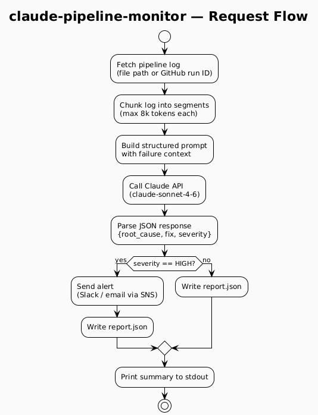

# AI / Claude

> **Why this matters in production:** Direct Claude API integration gives DevOps teams
> a fast path to LLM-powered automation without framework overhead — ideal for targeted
> scripts that fit naturally into existing CI/CD and Kubernetes workflows.

This directory contains utilities that call the **Anthropic Claude API** directly to solve
real DevOps problems: diagnosing pipeline failures, analyzing logs at scale, and providing
natural-language Kubernetes troubleshooting.

---

## Prerequisites

- Python 3.11+
- `ANTHROPIC_API_KEY` environment variable set
- `pip install anthropic`
- Podman (for generating diagrams — see [CLAUDE.md](../../CLAUDE.md))

---

## Utilities

| Utility | Description | Input | Output |
|---|---|---|---|
| [claude-pipeline-monitor](claude-pipeline-monitor/) | Analyzes CI/CD pipeline failures using Claude and returns a structured root-cause report | Log file or GitHub Actions run ID | `report.json` with `root_cause`, `fix_suggestion`, `severity` |
| [claude-log-analyzer](claude-log-analyzer/) | Streams application/system logs to Claude, detects anomalies and generates an incident summary | Log file path or stdin | `analysis.md` with timeline, anomalies, and recommendations |
| [claude-k8s-assistant](claude-k8s-assistant/) | Natural-language Kubernetes troubleshooting — runs `kubectl` commands and feeds output to Claude | Plain-English question | Diagnosis + suggested remediation commands |

All utilities support `--dry-run` mode using fixture data (no live API calls).

---

## Architecture


> Source: [plantuml/architecture.puml](plantuml/architecture.puml)

---

## Pipeline Monitor — Request Flow



> Source: [plantuml/pipeline-flow.puml](plantuml/pipeline-flow.puml)

---

## Generating Diagrams

From the repository root:

```bash
podman run --rm -v "$(pwd):/data:z" plantuml/plantuml -tpng -o /data/imgs/diagrams/ai/ /data/AI/Claude/plantuml/architecture.puml
podman run --rm -v "$(pwd):/data:z" plantuml/plantuml -tpng -o /data/imgs/diagrams/ai/ /data/AI/Claude/plantuml/pipeline-flow.puml
```

---

## Related Tools in this Repo

- [Kubernetes/plantuml](../../Kubernetes/plantuml/) — self-hosted PlantUML server on K8s
- [Kubernetes/sops](../../Kubernetes/sops/) — manage `ANTHROPIC_API_KEY` as an encrypted K8s secret
- [Aws/transcribe](../../Aws/transcribe/) — AWS Transcribe integration (pairs with claude-log-analyzer for audio incident reviews)
