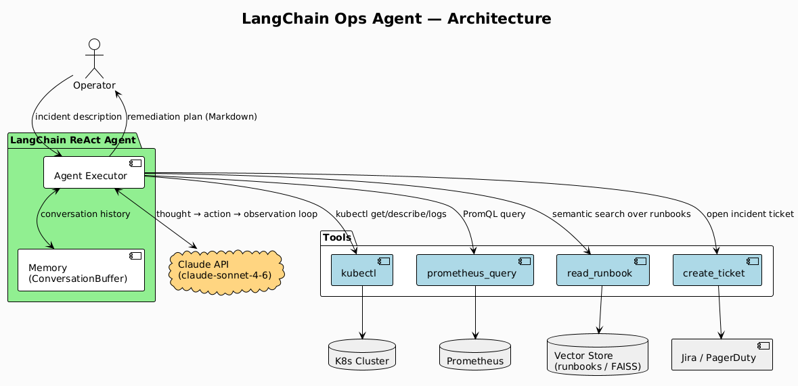
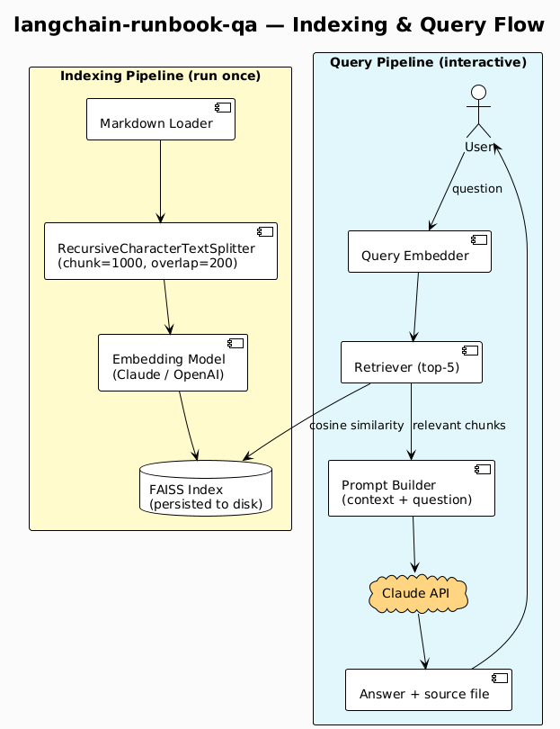

# AI / LangChain

> **Why this matters in production:** LangChain agents turn one-shot LLM calls into
> autonomous investigation loops — the agent decides which tools to run, interprets results,
> and iterates until it has a complete answer. This is the pattern behind modern AI-assisted
> on-call and self-healing infrastructure.

This directory contains agent-based infrastructure automation built with **LangChain** and
the **Claude API**. Utilities cover autonomous incident investigation, conversational runbook
Q&A, and automated first-response for alerting systems.

LangChain version: `>=0.3` — all chains use **LCEL** (LangChain Expression Language).

---

## Prerequisites

- Python 3.11+
- `ANTHROPIC_API_KEY` environment variable set
- `pip install langchain langchain-anthropic faiss-cpu`
- For `langchain-incident-responder`: `pip install fastapi uvicorn slack-sdk`
- Podman (for generating diagrams — see [CLAUDE.md](../../CLAUDE.md))

---

## Utilities

| Utility | Description | Tools used by agent |
|---|---|---|
| [langchain-ops-assistant](langchain-ops-assistant/) | ReAct agent that autonomously investigates incidents using kubectl, Prometheus, and runbook search | `kubectl`, `prometheus_query`, `read_runbook`, `create_ticket` |
| [langchain-runbook-qa](langchain-runbook-qa/) | Conversational Q&A over your Markdown runbooks using a local FAISS vector store | FAISS retriever + Claude |
| [langchain-incident-responder](langchain-incident-responder/) | FastAPI webhook receiver (AlertManager/PagerDuty) that runs a triage agent and posts a structured card to Slack | `kubectl`, `prometheus_query`, Slack SDK |

All utilities support `--dry-run` mode.

---

## Agent Architecture



> Source: [plantuml/agent-architecture.puml](plantuml/agent-architecture.puml)

---

## Runbook Q&A — Indexing & Query Flow



> Source: [plantuml/runbook-qa-flow.puml](plantuml/runbook-qa-flow.puml)

---

## Generating Diagrams

From the repository root:

```bash
podman run --rm -v "$(pwd):/data:z" plantuml/plantuml -tpng -o /data/imgs/diagrams/ai/ /data/AI/LangChain/plantuml/agent-architecture.puml
podman run --rm -v "$(pwd):/data:z" plantuml/plantuml -tpng -o /data/imgs/diagrams/ai/ /data/AI/LangChain/plantuml/runbook-qa-flow.puml
```

---

## Related Tools in this Repo

- [AI/RAG](../RAG/) — standalone RAG utilities that `langchain-runbook-qa` is built on top of
- [Kubernetes/sops](../../Kubernetes/sops/) — store `ANTHROPIC_API_KEY` securely in K8s
- [Kubernetes/slack-alarm](../../Kubernetes/slack-alarm/) — existing Slack notification pattern used by `langchain-incident-responder`
