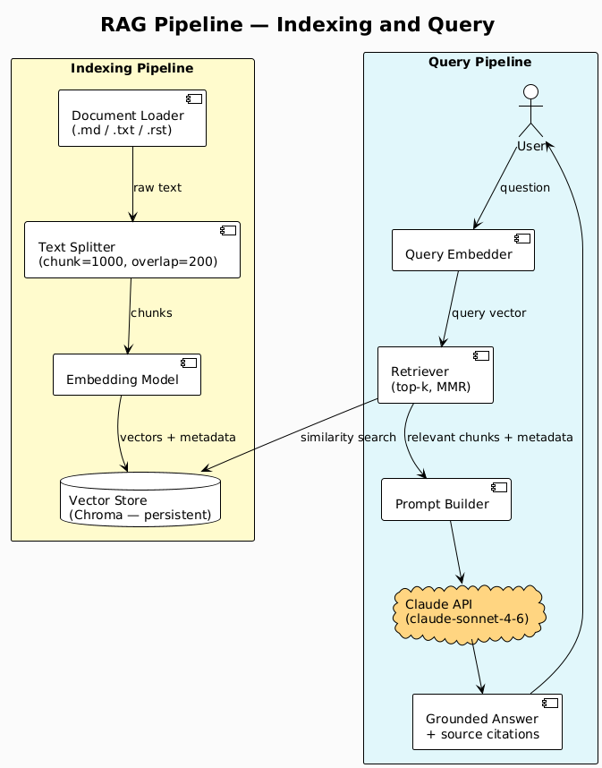
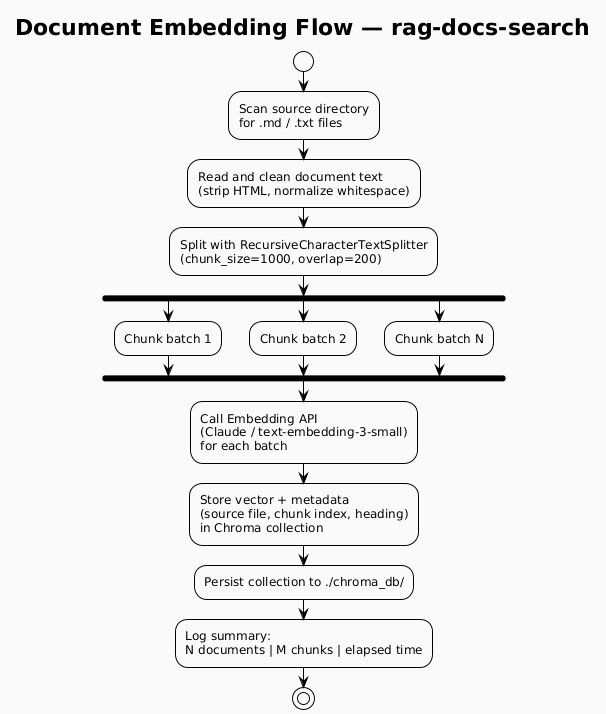

# AI / RAG

> **Why this matters in production:** RAG (Retrieval-Augmented Generation) lets you query
> your own internal documentation, runbooks, and changelogs with the accuracy of a search
> engine and the fluency of an LLM — without hallucinations about content that isn't there.

This directory contains **Retrieval-Augmented Generation** systems for infrastructure knowledge.
All utilities use a local vector store (Chroma, persisted to disk) so there is no dependency
on external embedding services at query time.

---

## Prerequisites

- Python 3.11+
- `ANTHROPIC_API_KEY` environment variable set
- `pip install anthropic langchain langchain-anthropic chromadb`
- For `rag-docs-search` FAISS variant: `pip install faiss-cpu`
- Podman (for generating diagrams — see [CLAUDE.md](../../CLAUDE.md))

---

## Utilities

| Utility | Description | Vector Store | Use Case |
|---|---|---|---|
| [rag-docs-search](rag-docs-search/) | Semantic search over any directory of Markdown/text docs with Claude-generated summaries | FAISS (in-memory / file) | Internal wikis, architecture docs, ADRs |
| [rag-k8s-troubleshooter](rag-k8s-troubleshooter/) | Indexes Kubernetes official docs + custom runbooks; answers error messages and symptoms | Chroma (persistent) | On-call troubleshooting, CrashLoopBackOff, OOMKilled |
| [rag-changelog-analyzer](rag-changelog-analyzer/) | Indexes CHANGELOG files and GitHub release notes; answers "what changed between v1.12 and v1.14?" | Chroma (persistent) | Upgrade impact analysis, CVE triage, dependency reviews |

All utilities support `--dry-run` mode and a `--reindex` flag to rebuild the vector store.

---

## RAG Pipeline



> Source: [plantuml/rag-pipeline.puml](plantuml/rag-pipeline.puml)

---

## Document Embedding Flow



> Source: [plantuml/embedding-flow.puml](plantuml/embedding-flow.puml)

---

## Embedding Model Choice

| Model | Pros | Cons |
|---|---|---|
| `text-embedding-3-small` (OpenAI) | Fast, cheap, high quality | Requires OpenAI API key |
| `claude` embeddings via `langchain-anthropic` | Single API key for the whole stack | Slower than dedicated embedding model |
| `sentence-transformers/all-MiniLM-L6-v2` | Fully local, no API costs | Lower quality on technical text |

Default: `text-embedding-3-small`. Override with `--embedding-model` flag.

---

## Generating Diagrams

From the repository root:

```bash
podman run --rm -v "$(pwd):/data:z" plantuml/plantuml -tpng -o /data/imgs/diagrams/ai/ /data/AI/RAG/plantuml/rag-pipeline.puml
podman run --rm -v "$(pwd):/data:z" plantuml/plantuml -tpng -o /data/imgs/diagrams/ai/ /data/AI/RAG/plantuml/embedding-flow.puml
```

---

## Related Tools in this Repo

- [AI/LangChain/langchain-runbook-qa](../LangChain/) — uses `rag-docs-search` as its indexing backend
- [Kubernetes/sops](../../Kubernetes/sops/) — encrypt the `ANTHROPIC_API_KEY` in K8s deployments
- [Linux/Bacula](../../Linux/Bacula/) — example of internal docs that `rag-docs-search` can index
