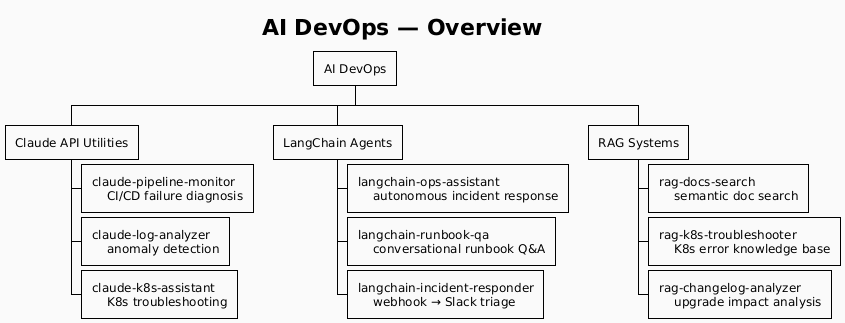
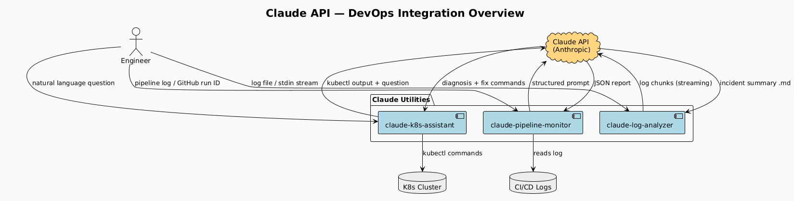

# AI DevOps

> Utilities demonstrating AI-augmented DevOps workflows using the Claude API, LangChain agents,
> and Retrieval-Augmented Generation. Built to showcase real-world AI DevOps patterns:
> automated diagnosis, autonomous incident response, and semantic search over infrastructure docs.



---

## Sections

### [Claude API Utilities](Claude/)

Direct Claude API integrations for targeted DevOps automation — no framework overhead.



| Utility | What it does |
|---|---|
| [claude-log-analyzer](Claude/claude-log-analyzer/) | Streams logs to Claude, detects anomalies, writes `analysis.md` |
| [claude-pipeline-monitor](Claude/claude-pipeline-monitor/) | Diagnoses CI/CD failures, outputs structured `report.json` |
| [claude-k8s-assistant](Claude/claude-k8s-assistant/) | Answers natural-language K8s questions by running `kubectl` and feeding output to Claude |

---

### [LangChain Agents](LangChain/)

ReAct agents that autonomously investigate and respond to infrastructure incidents.


| Utility | What it does |
|---|---|
| [langchain-ops-assistant](LangChain/langchain-ops-assistant/) | Multi-tool agent: kubectl + Prometheus + runbook search + ticket creation |
| [langchain-runbook-qa](LangChain/langchain-runbook-qa/) | Conversational Q&A over your Markdown runbooks via FAISS |
| [langchain-incident-responder](LangChain/langchain-incident-responder/) | FastAPI webhook → triage agent → structured Slack card |

---

### [RAG Systems](RAG/)

Retrieval-Augmented Generation for infrastructure knowledge bases.


| Utility | What it does |
|---|---|
| [rag-docs-search](RAG/rag-docs-search/) | Semantic search over any Markdown/text docs with Claude-generated summaries |
| [rag-k8s-troubleshooter](RAG/rag-k8s-troubleshooter/) | Answers K8s error messages using indexed official docs + custom runbooks |
| [rag-changelog-analyzer](RAG/rag-changelog-analyzer/) | Queries CHANGELOG files: "what changed between v1.12 and v1.14?" |

---

## Prerequisites

```bash
pip install anthropic langchain langchain-anthropic faiss-cpu chromadb sentence-transformers
export ANTHROPIC_API_KEY=sk-ant-...
```

See each utility's `requirements.txt` for exact dependencies.

---

## Implementation guide

Full design rationale, PlantUML sources, and implementation order:
[claude-docs/ai.md](../claude-docs/ai.md)
