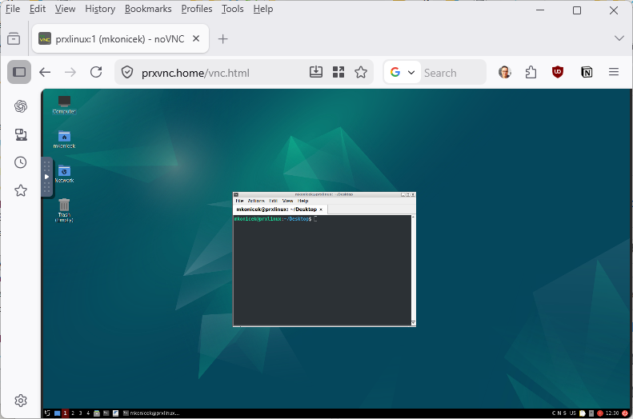

# LXQt + VNC on Ubuntu 24.04 — Complete Setup Guide

Deploy a full **LXQt graphical desktop** accessible from any browser via **noVNC over HTTPS**, running as your regular Linux user on Ubuntu 24.04. One script does everything: installs packages, configures VNC, generates a domain SSL certificate signed by your own root CA, and sets up nginx as a reverse proxy.



---

## Table of Contents

1. [Overview](#overview)
2. [Prerequisites](#prerequisites)
3. [Quick Start](#quick-start)
4. [What the Script Asks For](#what-the-script-asks-for)
5. [What Gets Installed](#what-gets-installed)
6. [Preparing Your Root CA](#preparing-your-root-ca)
7. [Running the Script](#running-the-script)
8. [Accessing the Remote Desktop](#accessing-the-remote-desktop)
9. [Trusting the Certificate](#trusting-the-certificate)
10. [Managing Services](#managing-services)
11. [Clipboard Usage](#clipboard-usage)
12. [Firewall Setup](#firewall-setup)
13. [Troubleshooting](#troubleshooting)

---

## Overview

The script `setup-lxqt-vnc.sh` automates the following on a fresh **Ubuntu 24.04** machine:

| Component | Details |
|---|---|
| **LXQt** | Lightweight Qt-based desktop environment |
| **TigerVNC** | VNC server, runs as your current user on display `:1` |
| **noVNC + websockify** | Browser-based VNC client, listens on `localhost:6080` |
| **nginx** | HTTPS reverse proxy, forwards `https://<domain>/` → noVNC |
| **SSL certificate** | Signed by your own root CA, valid for 3650 days (10 years) |

Services are registered as **systemd user units** — they start automatically on boot without requiring a login session (via `loginctl enable-linger`). nginx runs as a system service since it needs to bind to port 443.

---

## Prerequisites

- Ubuntu 24.04 (fresh install or existing system)
- A regular user account with `sudo` access
- Your own **root CA certificate and key** (see [Preparing Your Root CA](#preparing-your-root-ca))
- A domain name or local hostname that resolves to this machine (e.g. `vnc.home.lan`)

---

## Quick Start

```bash
git clone https://github.com/koss822/misc.git
cd misc/Linux/Ubuntu-VNC
chmod +x setup-lxqt-vnc.sh
./setup-lxqt-vnc.sh
```

---

## What the Script Asks For

| Prompt | Example | Notes |
|---|---|---|
| VNC password | `mysecretpass` | Minimum 6 characters |
| VNC resolution | `1920x1080` | Press Enter to accept default |
| Root CA certificate path | `/home/alice/ca/rootCA.crt` | Must exist — used to sign the domain cert |
| Root CA key path | `/home/alice/ca/rootCA.key` | Must exist — private key of your CA |
| Domain name | `vnc.home.lan` | Must resolve to this machine's IP |

---

## What Gets Installed

All packages installed via `apt` (requires sudo):

- `lxqt`, `openbox`, `lxterminal` — desktop environment
- `tigervnc-standalone-server` — VNC server
- `novnc`, `websockify` — browser VNC client
- `nginx` — HTTPS reverse proxy
- `openssl` — certificate generation
- `dbus-x11`, `fonts-noto-color-emoji`, `xdg-utils` — runtime dependencies

Generated files (owned by your user):

```
~/.config/tigervnc/passwd          # VNC password (binary, chmod 600)
~/.config/tigervnc/xstartup        # Starts LXQt on VNC connect
~/.config/lxqt/session.conf        # LXQt session settings
~/.config/lxterminal/lxterminal.conf # Terminal dark theme (Catppuccin Mocha)
~/.config/autostart/               # Disables power manager + screensaver
~/.config/systemd/user/            # vncserver.service + novnc.service
~/.certs/<domain>/                  # SSL key, CSR, cert
```

---

## Preparing Your Root CA

If you don't have a root CA yet, create one now (do this once, keep the files safe):

```bash
mkdir -p ~/ca
cd ~/ca

# Generate the root CA private key
openssl genrsa -out rootCA.key 4096

# Generate the self-signed root CA certificate (valid 10 years)
openssl req -x509 -new -nodes \
    -key rootCA.key \
    -sha256 \
    -days 3650 \
    -out rootCA.crt \
    -subj "/CN=My Home Root CA/O=Home Lab/C=CZ"
```

You now have:
- `~/ca/rootCA.key` — the CA private key (keep this secret!)
- `~/ca/rootCA.crt` — the CA certificate (you will install this into your browsers/OS)

When the setup script asks for the root CA certificate and key, provide the full paths to these files.

---

## Running the Script

```bash
./setup-lxqt-vnc.sh
```

The script will:

1. Prompt for VNC password, CA paths, and domain name
2. Install all packages with `sudo apt-get`
3. Write VNC and LXQt config files in your home directory
4. Generate `~/.certs/<domain>/<domain>.crt` signed by your CA
5. Write `/etc/nginx/sites-available/novnc` (requires sudo) and restart nginx
6. Create and start `vncserver` and `novnc` systemd user services
7. Enable `loginctl linger` so services start on boot

Total time: approximately 3–5 minutes on a typical machine.

---

## Accessing the Remote Desktop

Once the script finishes, open a browser and go to:

```
https://<domain>/vnc.html
```

For example:
```
https://vnc.home.lan/vnc.html
```

You will be prompted for the VNC password you set during installation.

> **DNS requirement:** The domain must resolve to the server's IP. For a local network, add a line to your router's DNS, Pi-hole, or the `/etc/hosts` file on your client machine:
> ```
> 192.168.1.50   vnc.home.lan
> ```

---

## Trusting the Certificate

The SSL certificate is signed by your root CA. Browsers won't trust it until you install the root CA certificate on your client machine.

### Windows

1. Copy `rootCA.crt` from the server to your Windows machine (e.g. via SCP or a USB drive)
2. Double-click `rootCA.crt`
3. Click **Install Certificate**
4. Select **Local Machine** → **Next**
5. Choose **Place all certificates in the following store**
6. Click **Browse** → select **Trusted Root Certification Authorities** → **OK**
7. Click **Next** → **Finish**
8. Restart your browser

### Linux (Chrome / Chromium)

```bash
# Copy the CA cert to the system trust store
sudo cp rootCA.crt /usr/local/share/ca-certificates/my-home-ca.crt
sudo update-ca-certificates

# For Chrome/Chromium on Linux, also add to the user NSS database
certutil -d sql:$HOME/.pki/nssdb -A -t "CT,," -n "My Home Root CA" -i rootCA.crt
```

### macOS

```bash
sudo security add-trusted-cert -d -r trustRoot -k /Library/Keychains/System.keychain rootCA.crt
```

### Firefox (any OS)

Firefox uses its own certificate store. Go to:

1. **Settings** → **Privacy & Security** → scroll to **Certificates**
2. Click **View Certificates** → **Authorities** tab
3. Click **Import** → select `rootCA.crt`
4. Check **Trust this CA to identify websites** → OK

---

## Managing Services

VNC and noVNC run as **systemd user services** under your account:

```bash
# Check status
systemctl --user status vncserver
systemctl --user status novnc

# Restart
systemctl --user restart vncserver
systemctl --user restart novnc

# View logs
journalctl --user -u vncserver -n 50
journalctl --user -u novnc -n 50
```

nginx runs as a **system service**:

```bash
sudo systemctl status nginx
sudo systemctl restart nginx
sudo nginx -t          # test config syntax
```

---

## Clipboard Usage

Browser security limits clipboard access. There are two options:

### Option A — noVNC clipboard panel (always works)

1. Click the **arrow** on the left edge of the noVNC screen to open the control bar
2. Click the **clipboard icon** (looks like a notepad)
3. **Paste into remote desktop:** type or paste text into the panel, then right-click inside the desktop → Paste
4. **Copy from remote desktop:** select text inside the desktop → the clipboard panel shows it

### Option B — automatic clipboard sync (HTTPS required)

When using HTTPS with a trusted certificate (which this setup provides), the browser can sync the clipboard automatically:

1. Open the noVNC control bar (left arrow)
2. Go to **Settings** → enable **Clipboard** if not already on
3. Allow clipboard permission when the browser asks
4. Copy/paste now works directly — no panel needed

---

## Firewall Setup

Restrict access so only HTTPS (nginx) and SSH are reachable from the network. The raw VNC port (5901) and noVNC port (6080) stay on localhost only.

```bash
sudo apt install ufw -y
sudo ufw default deny incoming
sudo ufw default allow outgoing
sudo ufw allow 22    # SSH
sudo ufw allow 443   # HTTPS (nginx → noVNC)
sudo ufw enable
sudo ufw status
```

Port 5901 (VNC) and 6080 (noVNC) are bound to `localhost` only and are not affected.

---

## Troubleshooting

**VNC server not starting?**
```bash
systemctl --user status vncserver
journalctl --user -u vncserver -n 50
# Check for leftover lock files
ls ~/.config/tigervnc/
vncserver -kill :1
systemctl --user start vncserver
```

**noVNC page loads but shows black screen?**

The VNC server may be starting but LXQt is failing to launch. Check the VNC log:
```bash
cat ~/.vnc/*.log 2>/dev/null || cat ~/.local/share/tigervnc/*.log 2>/dev/null
```

**nginx not starting?**
```bash
sudo nginx -t
sudo journalctl -u nginx --no-pager -n 50
# Check certificate paths in the config
sudo cat /etc/nginx/sites-available/novnc
```

**Certificate error in browser?**

Make sure the root CA is installed in the browser/OS trust store (see [Trusting the Certificate](#trusting-the-certificate)). Also verify the domain resolves correctly:
```bash
ping vnc.home.lan
curl -v https://vnc.home.lan/vnc.html
```

**Services not starting after reboot?**

Check that lingering is enabled for your user:
```bash
loginctl show-user "$USER" | grep Linger
# Should show: Linger=yes
# If not:
sudo loginctl enable-linger "$USER"
```

**Clipboard not working?**

Make sure you are accessing noVNC over `https://` and that the root CA is trusted. HTTP disables the clipboard API entirely in modern browsers.

---

## File Reference

| File | Purpose |
|---|---|
| `setup-lxqt-vnc.sh` | Main installation script |
| `README.md` | This tutorial |
| `README.old` | Original README from the OpenClaw/Proxmox setup |

---

## License

See [gpl.txt](../../gpl.txt) at the repository root.
